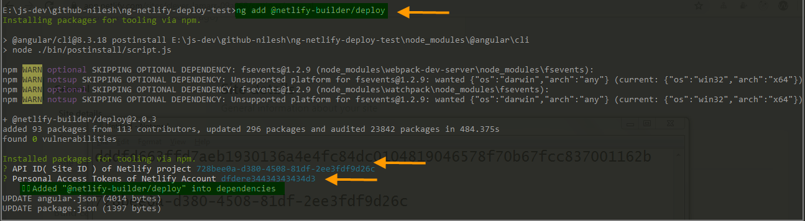
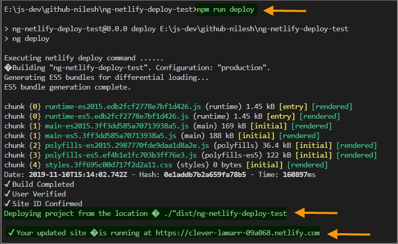

[](https://www.npmjs.com/package/@netlify-builder/deploy)
[](https://www.npmjs.com/package/@netlify-builder/deploy)

[](#contributors)

## **Deploy your Angular app to Netlify directly from the Angular CLI! 🚀**
### Pre-requisites
- Angular project created via [Angular CLI](https://github.com/angular/angular-cli) v8.3.0 or greater.

### Steps:
1. run `ng add @netlify-builder/deploy`
OR `ng add @netlify-builder/deploy --project={projectName}` to add necessary dependencies. Once, it get installed,you will be prompted to enter (a) Site Id and (b) Netlify Token
  
2. run ```ng deploy``` assuming that you have [Angular CLI](https://github.com/angular/angular-cli) installed globally

    OR
    
    add below script to ```package.json```
   ```
   "deploy":"ng deploy"
   ```

   


# Netlify Builder demo

This repository contains an example of the Angular CLI Architect API.

## Builder

You can find the Architect builder in the `src` directory.

## Sample application

The sample application which uses the Architect builder is available under the `builder-test` directory.

## License

MIT


## Setup

1. Move to src and run the below command

```sh
npm i
```

2. Run the below command to build the package

```sh
npm run build
```

3. run the below command to link the package

```
npm link
```

## Link to [Step by Step Guide](https://www.netlify.com/blog/2019/09/17/using-the-angular-builder-for-netlify/)

## Contributors ✨

Thanks goes to these wonderful people ([emoji key](https://allcontributors.org/docs/en/emoji-key)):

<!-- ALL-CONTRIBUTORS-LIST:START - Do not remove or modify this section -->
<!-- prettier-ignore-start -->
<!-- markdownlint-disable -->
<table>
  <tr>
    <td align="center"><a href="https://www.youtube.com/c/NitishKumarSingh"><br /><sub><b>Nitish Kumar Singh</b></sub></a><br /><a href="https://github.com/ngx-builders/netlify-builder/commits?author=nitishk72" title="Code">💻</a></td>
    <td align="center"><a href="https://github.com/Shaikh-Ubaid"><br /><sub><b>Shaikh-Ubaid</b></sub></a><br /><a href="https://github.com/ngx-builders/netlify-builder/commits?author=Shaikh-Ubaid" title="Documentation">📖</a></td>
    <td align="center"><a href="https://iamsurajdc.js.org"><br /><sub><b>Suraj Chandgude</b></sub></a><br /><a href="https://github.com/ngx-builders/netlify-builder/commits?author=iamsurajdc" title="Code">💻</a></td>
    <td align="center"><a href="https://www.santoshyadav.dev"><br /><sub><b>Santosh Yadav</b></sub></a><br /><a href="https://github.com/ngx-builders/netlify-builder/commits?author=santoshyadav198613" title="Code">💻</a></td>
    <td align="center"><a href="https://github.com/alan-agius4"><br /><sub><b>Alan Agius</b></sub></a><br /><a href="https://github.com/ngx-builders/netlify-builder/commits?author=alan-agius4" title="Code">💻</a></td>
    <td align="center"><a href="https://github.com/imranmomin"><br /><sub><b>Imran Momin</b></sub></a><br /><a href="https://github.com/ngx-builders/netlify-builder/commits?author=imranmomin" title="Code">💻</a></td>
    <td align="center"><a href="https://github.com/BioPhoton"><br /><sub><b>Michael Hladky</b></sub></a><br /><a href="https://github.com/ngx-builders/netlify-builder/commits?author=BioPhoton" title="Code">💻</a></td>
  </tr>
  <tr>
    <td align="center"><a href="https://github.com/NileshPatel17"><br /><sub><b>Nilesh Patel</b></sub></a><br /><a href="https://github.com/ngx-builders/netlify-builder/commits?author=NileshPatel17" title="Documentation">📖</a></td>
  </tr>
</table>

<!-- markdownlint-enable -->
<!-- prettier-ignore-end -->
<!-- ALL-CONTRIBUTORS-LIST:END -->

This project follows the [all-contributors](https://github.com/all-contributors/all-contributors) specification. Contributions of any kind welcome!
