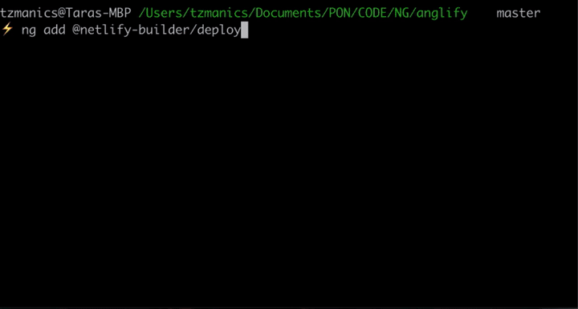
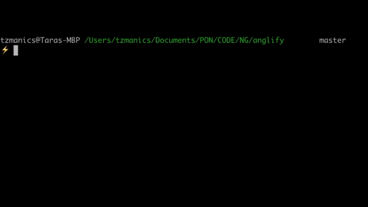

[](https://travis-ci.org/nitishk72/netlify-builder)
[](#contributors)
# Netlify Builder demo


This repository contains an example of the Angular CLI Architect API.

## Builder

You can find the Architect builder in the `command-builder` directory.

## Sample application

The sample application which uses the Architect builder is available under the `builder-test` directory.

## License

MIT


## Setup

1. Move to command-builder and run the below command

```sh
yarn install
```

2. Run the below command to build the package

```sh
yarn build
```

3. run the below command to link the package

```
npm link
```

## To test pacakge

1. Move to builder-test and run the below command

```sh
yarn install
```

2. Link the package

```sh
npm link @netlify-builder/deploy
```

3. Provide below config in angular.json
```json
   "deploy": {
          "builder": "@netlify-builder/deploy:deploy",
          "options": {
            "command": "deploy",
            "outputPath": "dist/builder-test",
            "netlifyToken": "[tokenValue]",
            "siteId": "[siteId]",
            "args": [
              "src/main.ts"
            ]
          }
        }
```

4. Test the command

```sh
ng run builder-test:deploy
```

Step By Step Guide To Using the Angular Builder for Netlify
===========================================================
>
> --- <cite>Tara Z. Manicsic</cite>


I was stoked to try out the [`netlify-builder`](https://github.com/ngx-builders/netlify-builder) built for the Angular CLI by [Santosh Yadav](https://www.santoshyadav.dev). It’s _super_ easy to use. One thing I was hesitant 😬 about was putting my personal access token in the public `angular.json` file. Instead I made a script to deploy any project by passing in my token as an environment variable. Come code with me 🤗.

First step: add the builder 🛠
------------------------------

To use the the builder we first want to add it to our Angular project with the handy `ng add` command. The [`ng add`](https://angular.io/cli/add) command from the Angular CLI will configure your project to use a published npm package library based on that library’s schematic.

_code to run in the command line:_

`ng add @netlify-builder/deploy`

Running this command will walk us through setting up the builder. It first asks for the project API ID or Site ID of your Netlify project. We can find this by going to the project page clicking ‘Settings’ in the top menu, then ‘Site Settings’ under the ‘General’ menu tab ([https://app.netlify.com/sites/](https://app.netlify.com/sites/)/settings/general#site-information)


The next step in the builder setup asks for our Personal Access Token but we don’t want to put that in a public file. If we do add it in this setup the builder adds that information to the `angular.json` file.


We want to avoid ☠️having that sensitive information in a public file that anyone can see. Luckily, the way Santosh set up the builder we don’t have to add the Token here, [instead it will check for an environment variable](https://github.com/ngx-builders/netlify-builder/blob/master/command-builder/deploy/index.ts#L33). So, we just hit enter to skip that part.


<br>

Second || Final Step: setting the Token 🗝 variable
---------------------------------------------------

We want to set the token by using a `process.env` global variable. To find your Netlify Token just head to [your application’s token generating page](https://app.netlify.com/user/applications/personal) or click on your avatar, the ‘User Settings’ option, click ‘Applications’ in the left menu, then click the ‘New access token’ button under ‘Personal access tokens’. We can type anything that is a good reference for you as the description of your token and click the ‘Generate’ button.


> NOTE: Make sure you copy the newly created token once it’s generated. You can’t view it again after you leave that page. You can always create a new one though 😎👍.

Normally, we would just need to write the command `ng deploy`. With this environment variable we now write:

_code to run in the command line:_

`NETLIFY_TOKEN=<token> ng deploy`

> ‼️ UPDATE: Since writing this post and creating these videos the Angular CLI team released a minor update that changes the deploy command from `ng run <project name>:deploy` to, simply, `ng deploy`. If you see this old command syntax in the video just know that the Angular CLI team has just saved you all those keystrokes 😍.


<br>
🌈 Way Cooler Last Step 🧜‍
---------------------------

Why type all that when we can make a shell command. In our `.bashrc` file we make a function of any name, in this case we’ll call it `netliLove`. In this function we can set the `NETLIFY_TOKEN` environment variable to the access token we copied earlier. We can use this token for every product so we will hardcode it here.

_code to add to `~/.bashrc`:_

    netliLove() {
      NETLIFY_TOKEN=<token> ng deploy
    }


<br>
Here’s what we’ve accomplished in this post:

*   added [`netlify-builder`](https://www.npmjs.com/package/@netlify-builder/deploy) to our Angular application
*   used it to deploy our application with an environment variable instead of adding our token to a public file
*   made a totally rad bash script that stores our token to be used with any project and saves us keystrokes

You should be proud of yourself. I’m proud of you. Go you!

No 🙅🏻‍ More Steps
-------------------

That’s it! Whichever way you decide to use the builder, I hope you had a fun time setting it up. At least, I hope you found it to be a painless process. I really appreciate Santosh putting the work into creating this builder AND making it [open source](https://github.com/ngx-builders/netlify-builder). If you’d like to contribute or check out the code you can find it [here on GitHub](https://github.com/ngrx-builders/netlify-builder) and you can learn more about Santosh [on his website](https://www.santoshyadav.dev/).

Not ready for the coding fun to end? Check out these other resources:

*   Dive into our [docs](https://www.netlify.com/docs/)!
*   Add [Fauna DB](https://www.netlify.com/blog/2019/09/10/announcing-the-faunadb-add-on-for-netlify/) to your project.

Happy coding, everyone!


## Contributors ✨

Thanks goes to these wonderful people ([emoji key](https://allcontributors.org/docs/en/emoji-key)):

<!-- ALL-CONTRIBUTORS-LIST:START - Do not remove or modify this section -->
<!-- prettier-ignore -->
<table>
  <tr>
    <td align="center"><a href="https://www.youtube.com/c/NitishKumarSingh"><br /><sub><b>Nitish Kumar Singh</b></sub></a><br /><a href="https://github.com/ngx-builders/netlify-builder/commits?author=nitishk72" title="Code">💻</a></td>
  </tr>
</table>

<!-- ALL-CONTRIBUTORS-LIST:END -->

This project follows the [all-contributors](https://github.com/all-contributors/all-contributors) specification. Contributions of any kind welcome!
